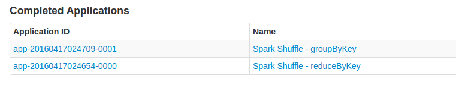
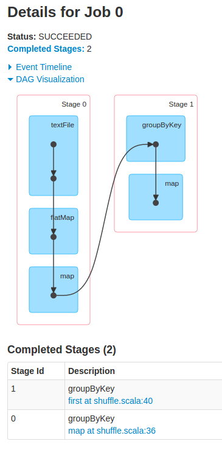
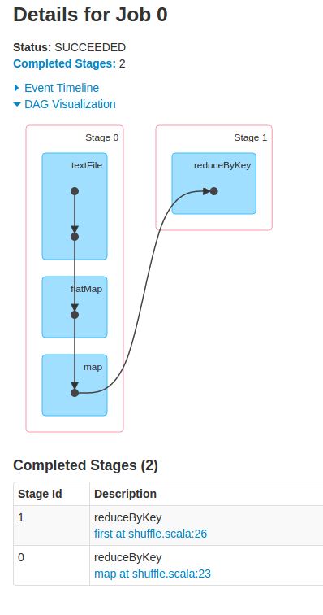
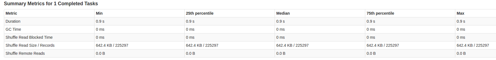

# spark-shuffle-sample
Demonstrate the difference in shuffle operation when using reduceByKey and groupByKey

## How to use this demo?

Best way to use this demo is by taking the JAR from the artifacts directory and using spark-submit:

### Running using spark-submit:

```
[spark_home]/bin/spark-submit --master [your spark master URL] --class org.xm.shuffleSampleDriver [path to spark-shuffle.jar]
```

### pre-requisites:
1. Have a running hdfs cluster with text files located in /data directories
2. hdfs cluster should be accessible through ```hdfs://master:9000/data/```
3. spark history and event logging should be enabled [See How to enable spark history and event logging for details](./#how-to-enable-spark-history-and-event-logging)

### How results looks like?

Once the program complete you should open spark web UI and see the following:


As sean from the picture we have two competed applications one for reduceByKey and one for groupByKey
Drill down to each of the jobs and look at the DAG:

GroupByKey            | ReduceByKey
----------------------|------------
 | 

clicking on the operation itself (reduceByKey and groupNyKey respectively will show you the step details. 
 
For example here are the details for the groupBy operation:


Compare the Shuffle size of both operation.

Why is that happening? have a look at [Everyday I'm Shuffling - Tips for Writing Better Spark ](http://www.slideshare.net/databricks/strata-sj-everyday-im-shuffling-tips-for-writing-better-spark-programs)

#### How to enable spark history and event logging
1. Goto [SPARK_HOME]/conf
2. Copy ```spark-env.sh.template``` to ```spark-env.sh```
3. Chabge the following settings:
```
spark.eventLog.enabled           true
spark.eventLog.dir               hdfs://master:9000/spark/history/log
```
4. Make sure your eventLog directory exist.


